# ⚡ OmniTools
### High-Performance • 100% Client-Side • Privacy-First Developer Utilities

 

  <b>Official community hub, feature request tracker, and architectural blueprint for <a href="https://www.devomnitools.com">OmniTools</a>.</b> 
  Free client-side utilities designed for modern software engineers, security analysts, and UI designers.

[**🌐 Open OmniTools Web App**](https://www.devomnitools.com) &bull;
[**🧩 Chrome &amp; Edge Extension**](https://www.devomnitools.com/en/extension/) &bull;
[**💡 Request a Tool**](https://github.com/contactumairrana/omnitools-community/issues/new?template=feature_request.md) &bull;
[**🐛 Report a Bug**](https://github.com/contactumairrana/omnitools-community/issues/new?template=bug_report.md) &bull;
[**🐦 Follow on X / Twitter**](https://x.com/devomnitools)

---

## 🔒 100% In-Browser Privacy Guarantee

> **Your data never leaves your computer.**  
> Unlike commercial utility platforms that transmit your sensitive database dumps, API keys, JSON payloads, or passwords across third-party backend servers, **OmniTools runs 100% locally in your browser memory**.
>
> * **Zero API calls** containing user input
> * **Zero third-party tracking** or data-mining scripts
> * **Native Web APIs** (`Web Cryptography API`, `Canvas API`, `FileReader`, and `Web Workers`)
> * **Air-Gapped & Offline Capable:** Disconnect your Wi-Fi or airplane mode — the entire suite operates completely offline as an installable PWA.

---

## 🏗️ Ecosystem & Growth Architecture

```mermaid
graph TD
  subgraph L1["🛡️ LAYER 1: Client-Side Sandbox (100% In-Browser Memory)"]
    A["Web Cryptography Engine<br/>• AES-256-GCM authenticated cipher<br/>• Bcrypt hash &amp; salt work-factor<br/>• HMAC &amp; SHA-512 checksums"]
    B["HTML5 Canvas 8K Engine<br/>• Vector SVG to PNG rasterizer (up to 8K)<br/>• QR Code with custom center logo<br/>• CSS Glassmorphism &amp; Flexbox visualizers"]
    C["Local AST &amp; Data Parsers<br/>• SQL INSERT into JSON / CSV converter<br/>• JSON to TypeScript recursive interface<br/>• Bi-directional YAML, XML, Markdown"]
  end

  subgraph L2["⚡ LAYER 2: Global Edge CDN (Cloudflare Pages Network)"]
    D["300+ Edge POPs<br/>• Sub-20ms global TTFB<br/>• HTTP/3 &amp; Brotli compression"]
    E["242 Static Prerendered Pages<br/>• Zero server cold-start latency<br/>• Instant client-side hydration"]
    F["Quad-Locale Global Distribution<br/>• English, Spanish, German, Arabic<br/>• Bi-directional RTL typography support"]
  end

  subgraph L3["🚀 LAYER 3: Omnichannel Traffic Flywheel"]
    G["Programmatic SEO &amp; Schema<br/>• Automated multi-lingual sitemaps<br/>• JSON-LD FAQ &amp; SoftwareApplication schema<br/>• OpenGraph &amp; Twitter Card cards"]
    H["Awesome Lists Backlinks<br/>• Brad Traversy (56K+ ⭐)<br/>• Marko Denic Web Dev Resources (6.5K+ ⭐)"]
    I["Chrome &amp; Edge Web Store<br/>• Omnipresent 1-click browser HUD<br/>• Sticky daily retention"]
    J["Developer Viral Loops<br/>• Reddit r/webdev launch threads<br/>• Twitter / X dev building-in-public updates"]
  end

  subgraph L4["💡 LAYER 4: Community Innovation Gateway"]
    K["Public Issue Tracker<br/>• Community tool requests<br/>• Verified bug triage"]
    L["Rapid Pipeline to 100+ Tools<br/>• Phase 5.1 &amp; Phase 5.2 expansion"]
    M["100% Proprietary Code Privacy<br/>• Secure deployment pipeline<br/>• Zero sensitive source leaked"]
  end

  L3 --> L2
  L2 --> L1
  L4 --> L3
```

---

## 🛠️ Complete Directory of 45 Live Production Tools

### 🎨 Design & Vector Utilities
| Tool | Features & Highlights | Direct Link |
| :--- | :--- | :--- |
| **CSS Flexbox Visual Playground** | Container alignment, item growth inspection, presets (Center, Navbar, Card Grid), Pure CSS & Tailwind output | [Launch Tool](https://www.devomnitools.com/en/tools/css-flexbox/) |
| **SVG to PNG & 8K Vector Rasterizer** | 1x to 8x scale multipliers (up to 8K print resolution), alpha transparency, PNG/WebP/JPEG export | [Launch Tool](https://www.devomnitools.com/en/tools/svg-to-png/) |
| **QR Code Generator & Scanner** | Custom center logo branding, Reed-Solomon error correction (L/M/Q/H), vCard/WiFi payloads, SVG vector export | [Launch Tool](https://www.devomnitools.com/en/tools/qr-code-generator/) |
| **CSS Glassmorphism Generator** | Frosted glass visual builder with depth sliders, noise overlay, and backdrop-filter CSS snippets | [Launch Tool](https://www.devomnitools.com/en/tools/css-glassmorphism/) |
| **CSS Clip-Path Generator** | Visual polygon and geometric path builder with draggable handles | [Launch Tool](https://www.devomnitools.com/en/tools/css-clip-path/) |
| **Color Contrast Checker (WCAG AAA)** | APCA and WCAG 2.1 contrast ratio validator with live foreground/background picker | [Launch Tool](https://www.devomnitools.com/en/tools/color-contrast-checker/) |
| **Color Converter & Palette Generator** | HEX, RGB, HSL, CMYK, and HSV live synchronized color space converter | [Launch Tool](https://www.devomnitools.com/en/tools/color-converter/) |

### 💻 Developer & Data Utilities
| Tool | Features & Highlights | Direct Link |
| :--- | :--- | :--- |
| **SQL to JSON & CSV Converter** | Converts single & multi-row `INSERT INTO` statements into JSON arrays and CSV/TSV with live Data Grid preview | [Launch Tool](https://www.devomnitools.com/en/tools/sql-to-json/) |
| **Base64 Image Encoder & Decoder** | Drag-and-drop image to Data URI, HTML ``, and CSS; decode Base64 back to downloadable PNG/JPG | [Launch Tool](https://www.devomnitools.com/en/tools/base64-image/) |
| **JSON Formatter & Validator** | RFC 8259 syntax parsing, tree metrics, 2/4/tab formatting, 1-click minification | [Launch Tool](https://www.devomnitools.com/en/tools/json-formatter/) |
| **JSON to TypeScript Generator** | Recursive interface inference, optional properties, nested type resolution | [Launch Tool](https://www.devomnitools.com/en/tools/json-to-ts/) |
| **YAML to JSON Converter** | Bi-directional lossless parsing between YAML and JSON schemas | [Launch Tool](https://www.devomnitools.com/en/tools/yaml-json-converter/) |
| **Multi-Dialect SQL Formatter** | PostgreSQL, MySQL, SQLite, and IBM Db2 syntax beautifier | [Launch Tool](https://www.devomnitools.com/en/tools/sql-formatter/) |
| **XML Formatter & Tree Inspector** | Indents and cleans complex XML feeds and SOAP payloads | [Launch Tool](https://www.devomnitools.com/en/tools/xml-formatter/) |
| **Markdown to HTML Converter** | Instant GitHub-flavored markdown preview with clean HTML markup output | [Launch Tool](https://www.devomnitools.com/en/tools/markdown-html/) |
| **Markdown Table Generator** | Visual spreadsheet editor exporting formatted GitHub-flavored Markdown tables | [Launch Tool](https://www.devomnitools.com/en/tools/markdown-table-generator/) |
| **Code Minifier** | Instant compression for HTML, CSS, and JavaScript | [Launch Tool](https://www.devomnitools.com/en/tools/code-minifier/) |
| **Text Diff Checker** | Character-by-character side-by-side diff with syntax highlighting | [Launch Tool](https://www.devomnitools.com/en/tools/diff-checker/) |

### 🛡️ Security & Cryptography
| Tool | Features & Highlights | Direct Link |
| :--- | :--- | :--- |
| **AES-256-GCM Encryption / Decryption** | PBKDF2 key derivation (100k iterations), random 96-bit IV, authenticated ciphertext | [Launch Tool](https://www.devomnitools.com/en/tools/aes-encryption/) |
| **Bcrypt Hash & Salt Verifier** | Client-side salt calculation with adjustable work factor (4–14) | [Launch Tool](https://www.devomnitools.com/en/tools/bcrypt-generator/) |
| **JWT Decoder & Inspector** | RFC 7519 3-part decoder with live token expiration countdown timer | [Launch Tool](https://www.devomnitools.com/en/tools/jwt-decoder/) |
| **Cryptographic Hash Generator** | MD5, SHA-1, SHA-256, SHA-384, and SHA-512 with checksum comparator | [Launch Tool](https://www.devomnitools.com/en/tools/hash-generator/) |
| **HMAC Generator** | Keyed-hash message authentication code generator with secret key | [Launch Tool](https://www.devomnitools.com/en/tools/hmac-generator/) |
| **Password Entropy Tester** | Mathematical zxcvbn-style entropy scoring with brute-force resistance time estimates | [Launch Tool](https://www.devomnitools.com/en/tools/password-entropy-tester/) |
| **Content Security Policy (CSP) Builder** | Interactive anti-XSS header generator with directive presets | [Launch Tool](https://www.devomnitools.com/en/tools/csp-header-builder/) |

### 🌐 Network & System Utilities
| Tool | Features & Highlights | Direct Link |
| :--- | :--- | :--- |
| **cURL to Fetch/Python/Go Converter** | Transforms raw cURL commands into production Node, Python requests, and Go code | [Launch Tool](https://www.devomnitools.com/en/tools/curl-converter/) |
| **CIDR Subnet Calculator** | IPv4 mask calculation, broadcast addresses, usable host ranges | [Launch Tool](https://www.devomnitools.com/en/tools/cidr-subnet-calculator/) |
| **HTTP Status Codes Inspector** | Complete searchable RFC 9110 status codes reference guide | [Launch Tool](https://www.devomnitools.com/en/tools/http-status-inspector/) |
| **User-Agent Parser** | Decodes browser engines, OS versions, and device architectures | [Launch Tool](https://www.devomnitools.com/en/tools/user-agent-parser/) |
| **Robots.txt Validator & Tester** | Tests URL path access against Googlebot and AI web crawlers | [Launch Tool](https://www.devomnitools.com/en/tools/robots-txt-tester/) |

---

## 🌟 Awesome Lists & Community Backlinks

OmniTools is actively submitted and listed in major curated open-source repositories:

* [**Brad Traversy Design Resources**](https://github.com/bradtraversy/design-resources-for-developers) (~56,000+ ⭐) — Listed under `Online Design Tools` ([PR #1731](https://github.com/bradtraversy/design-resources-for-developers/pull/1731))
* [**Marko Denic Web Development Resources**](https://github.com/markodenic/web-development-resources) (~6,500+ ⭐) — Listed under `Online Tools` ([PR #820](https://github.com/markodenic/web-development-resources/pull/820))

---

## 🤝 Community & Support

Have an idea for a tool that would simplify your developer workflow?
1. Check existing requests in our [**Issues Tracker**](https://github.com/contactumairrana/omnitools-community/issues).
2. [**Submit a Tool Request**](https://github.com/contactumairrana/omnitools-community/issues/new?template=feature_request.md) with input/output requirements.
3. Star this repository to help spread private, free developer tools! ⭐

---

## 📄 License
Released under the [MIT License](LICENSE).  
Created and maintained with ❤️ by [**Muhammad Umair**](https://github.com/contactumairrana) and the OmniTools community.
